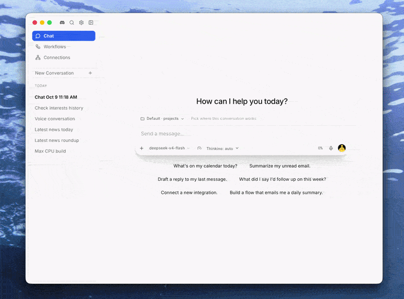
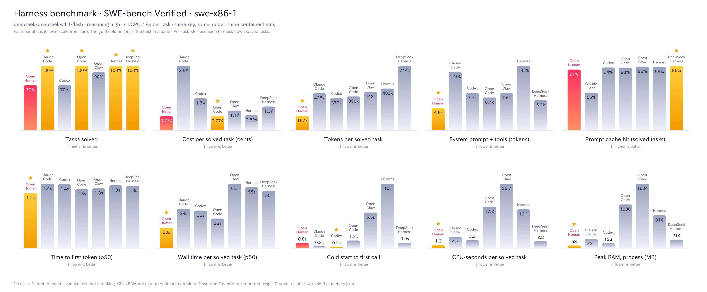

<h1 align="center">OpenHuman</h1>

<p align="center">
 <strong>The fastest, cheapest, most efficient open-source agent harness. Run more than 500 agents on a $10 VPS.</strong><br/>
 A desktop app for people. A Rust library for developers.
</p>

<p align="center">
 
</p>

<p align="center">
	<a href="https://trendshift.io/repositories/23680" target="_blank">
		
	</a>
	<a href="https://www.producthunt.com/products/openhuman?embed=true&amp;utm_source=badge-top-post-badge&amp;utm_medium=badge&amp;utm_campaign=badge-openhuman" target="_blank" rel="noopener noreferrer">
		
	</a>
	<a href="https://www.producthunt.com/products/openhuman?embed=true&amp;utm_source=badge-top-post-badge&amp;utm_medium=badge&amp;utm_campaign=badge-openhuman" target="_blank" rel="noopener noreferrer">
		
	</a>
</p>

<p align="center">
 
 <a href="https://github.com/tinyhumansai/openhuman/releases/latest"></a>
 <a href="https://github.com/tinyhumansai/openhuman/stargazers"></a>
 <a href="./LICENSE"></a>
 <a href="https://github.com/tinyhumansai/openhuman-benchmarks"></a>
</p>

<p align="center">
 <a href="https://tinyhumans.gitbook.io/openhuman/">Docs</a> ·
 <a href="./gitbooks/developing/quickstart.md">Rust quickstart</a> ·
 <a href="https://tinyhumansai.github.io/openhuman-benchmarks/">Benchmarks</a> ·
 <a href="https://github.com/tinyhumansai/openhuman/discussions">Discussions</a> ·
 <a href="https://guild.tinyhumans.ai/">Discord</a> ·
 <a href="https://www.reddit.com/r/tinyhumansai/">Reddit</a> ·
 <a href="https://x.com/intent/follow?screen_name=tinyhumansai">X</a> ·
 <a href="https://x.com/intent/follow?screen_name=senamakel">@senamakel (creator)</a>
</p>

<p align="center">
  <a href="./README.md">English</a> | <a href="./docs/README.ar.md">العربية</a> | <a href="./docs/README.zh-CN.md">简体中文</a> | <a href="./docs/README.ja-JP.md">日本語</a> | <a href="./docs/README.ko.md">한국어</a> | <a href="./docs/README.de.md">Deutsch</a> | <a href="./docs/README.tr.md">Türkçe</a> | <a href="./docs/README.ur-pk.md">اردو</a>
</p>

> [!NOTE]
> 🎉 Within one week of launch, OpenHuman became the **number one trending repository on GitHub** for nine days in a row.

> **Early beta.** OpenHuman is under active development, so expect rough edges.

---

## Install

Download the desktop app from [tinyhumans.ai/openhuman](https://tinyhumans.ai/openhuman?utm_source=github&utm_medium=readme) or the [latest release](https://github.com/tinyhumansai/openhuman/releases/latest).

| Platform | Install |
| --- | --- |
| macOS | `brew install --cask openhuman` |
| Windows | The signed `.msi` from the [latest release](https://github.com/tinyhumansai/openhuman/releases/latest) |
| Debian / Ubuntu | `sudo apt-get install ./OpenHuman_*_amd64.deb` after downloading the `.deb` |
| Arch | The [`openhuman-bin`](./packages/arch/openhuman-bin/) AUR recipe |
| Script (macOS, Linux) | `curl -fsSL https://raw.githubusercontent.com/tinyhumansai/openhuman/main/scripts/install.sh \| bash` |

The script path has no signature check, so prefer a package where you can. Platform notes and troubleshooting are in [INSTALL.md](./INSTALL.md).

---

## Why OpenHuman

Most harnesses run one heavy process per agent and resend a big prompt on every call. OpenHuman is a Rust core that does the same work with less of everything, and it is the only feature-rich open-source harness built to run large fleets of agents. Where other harnesses need a beefy machine per handful of agents, OpenHuman runs 500 on a $10 server.

<table>

<tr>

<td width="50%" valign="top">

<h3>Fast</h3>

<p><b>20 s</b> per solved SWE-bench task, the fastest of seven harnesses (others: 28 to 62 s). Cold start in 102 ms.</p>

<p><a href="https://github.com/tinyhumansai/openhuman-benchmarks/blob/main/results/swe-x86-1/summary.md">Benchmark results</a> · <a href="./gitbooks/developing/performance.md">Cold-start numbers</a></p>

</td>

<td width="50%" valign="top">

<h3>Cheap</h3>

<p><b>2.6x fewer tokens</b> per solved task and the lowest total spend. Small prompts, plus token compression on tool output.</p>

<p><a href="https://github.com/tinyhumansai/openhuman-benchmarks/blob/main/results/swe-x86-1/summary.md">Cost and token data</a> · <a href="./gitbooks/features/token-compression.md">How compression works</a></p>

</td>

</tr>

<tr>

<td width="50%" valign="top">

<h3>Efficient at scale</h3>

<p><b>8x less</b> memory and CPU per task. Each extra agent costs about 1.8 MiB: 500 agents fit in 1.4 GiB, which is a $10, 2 GB VPS.</p>

<p><a href="./gitbooks/developing/performance.md">Fleet measurements</a> · <a href="./docs/library-benchmarking.md">Methodology</a></p>

</td>

<td width="50%" valign="top">

<h3>Built for developers</h3>

<p>A library first. Call an agent like a function from your Rust code, or run a fleet of full-featured agents from one small server.</p>

<p><a href="./gitbooks/developing/quickstart.md">Rust quickstart</a> · <a href="./gitbooks/developing/embedding.md">Embedding guide</a> · <a href="./crates/openhuman-embed/examples">Examples</a></p>

</td>

</tr>

</table>

---

## Major innovations

The speed and density above come from a handful of design choices most harnesses do not make. Each card links to the docs and the open-source code behind it.

<table>

<tr>

<td width="50%" valign="top">

<h3>TokenJuice: RLM-style context</h3>

<p>Big tool output never lands in the prompt whole. TinyJuice compresses it by kind (JSON, diffs, logs, code, HTML) and turns large results into handles the agent queries with <code>juice_find</code>, <code>juice_extract</code> and <code>juice_summarize</code>. The full original stays one <code>juice_retrieve</code> away, so nothing is lost.</p>

<p><a href="./gitbooks/features/token-compression.md">Token compression</a> · <a href="https://github.com/tinyhumansai/tinyjuice">tinyjuice</a></p>

</td>

<td width="50%" valign="top">

<h3>Jev: decisions without prose</h3>

<p>Picking a tool should not cost a paragraph of reasoning. Jev is a small decision model that scores a fixed set of options. On 1,215 candidate tools it picks the right one first <b>62%</b> of the time against BM25's 22.5%, and cuts needless tool calls from 26 to 1 out of 31.</p>

<p><a href="./gitbooks/developing/jev.md">Jev</a> · <a href="./docs/plans/jev-tool-search-baseline.md">Tool-search baseline</a></p>

</td>

</tr>

<tr>

<td width="50%" valign="top">

<h3>TinyBus: capabilities as modules</h3>

<p>Search, documents, browser and computer use, voice, wallet, MCP and more are native modules behind small, versioned contract crates. Fourteen are pinned by SHA-256 and loaded lazily, so an agent that never opens a PDF never pays for the PDF engine.</p>

<p><a href="./gitbooks/developing/loadable-modules.md">Loadable modules</a> · <a href="https://github.com/tinyhumansai/tinybus">tinybus</a></p>

</td>

<td width="50%" valign="top">

<h3>One API key for everything</h3>

<p>A single TinyHumans key covers managed inference (including the OpenRouter catalogue), web search, embeddings, voice, media generation, integrations and Jev. Pass it once in code or as one environment variable. Bring your own providers instead whenever you like.</p>

<p><a href="./gitbooks/developing/tinyhumans-api-key.md">The TinyHumans API key</a> · <a href="./gitbooks/developing/engines.md">Engines</a></p>

</td>

</tr>

<tr>

<td width="50%" valign="top">

<h3>Cache-stable sessions</h3>

<p>A conversation maps to one transcript, deterministically. A resumed thread reuses its exact system prompt and tool list, so the provider's prefix cache stays warm across restarts, and compaction seals old generations on disk instead of erasing them.</p>

<p><a href="./gitbooks/developing/architecture/agent-harness.md">Agent harness</a> · <a href="https://github.com/tinyhumansai/tinyagents">tinyagents</a></p>

</td>

<td width="50%" valign="top">

<h3>Pluggable to the core</h3>

<p>The LLM, embeddings, memory engine and web search are all chosen by config. Every capability is a Cargo feature, so a stripped build with nothing enabled is 51 MiB and you compile only what your product uses.</p>

<p><a href="./gitbooks/developing/engines.md">Pluggable engines</a> · <a href="./gitbooks/developing/performance.md">Performance</a></p>

</td>

</tr>

</table>

---

## Benchmarks

<p align="center">
 <picture>
  <source media="(prefers-color-scheme: dark)" srcset="./gitbooks/.gitbook/assets/benchmarks/swe-x86-1-dark.png" />
  <source media="(prefers-color-scheme: light)" srcset="./gitbooks/.gitbook/assets/benchmarks/swe-x86-1.png" />
  
 </picture>
</p>

Seven harnesses, the same SWE-bench tasks, the same model, key and container, every call metered on the wire. It is all public and reproducible in [openhuman-benchmarks](https://github.com/tinyhumansai/openhuman-benchmarks). Latest run: [`swe-x86-1`](https://github.com/tinyhumansai/openhuman-benchmarks/blob/main/results/swe-x86-1/summary.md), ten tasks.

The outcome: OpenHuman finished its solved tasks in less than half the median time, on 2.6x fewer tokens, with an eighth of the memory and CPU. Across the whole run it made 114 model calls where the others made 134 to 212, and it spent $0.05 in total where the others spent $0.08 to $0.35.

Why it wins comes down to doing less per step. The core is compiled Rust running in one process, not a Node or Python runtime, so it idles at a fraction of the memory and burns almost no CPU between model calls. It sends the smallest prompt in the field (a 944-token system prompt and 20 tool schemas), so every call is cheaper and answers faster (1.65 s median latency, also the fastest). And it reaches an answer in fewer calls, which is where most of the token and time savings come from. The gap still to close is accuracy: it solved 7 of 10 tasks, where four harnesses solved all ten.

| `swe-x86-1`, per solved task | OpenHuman | Median of the other six | Best of the other six |
| --- | --- | --- | --- |
| Wall time (p50) | **19.8 s** | 46.5 s | 28.4 s (OpenCode) |
| Tokens | **167k** | 435k | 370k (Codex) |
| Cost | $0.0077 | $0.012 | $0.0077 (OpenCode, a tie) |
| Peak memory | **68 MB** | 523 MB | 123 MB (Codex) |
| CPU time | **1.3 s** | 10.4 s | 2.9 s (DeepSeek Harness) |
| System prompt | **4.6k tokens** | 7.7k | 6.2k (DeepSeek Harness) |
| Tasks solved | 7 / 10 | 10 / 10 | 10 / 10 (four harnesses) |

---

## For users

If you already run Claude Code, Codex, OpenClaw or Hermes, the concepts carry over: an agent loop with tools, subagents, MCP, skills, BYOK models and persistent memory. OpenHuman puts all of it in a desktop app, a terminal UI and a headless server, on the same Rust core.

| Capability | What OpenHuman ships |
| --- | --- |
| Persistent memory | [RAG over your files, repos, feeds and apps](./gitbooks/features/memory.md), recalled before every turn, answers with citations |
| Tools | [Native tools](./gitbooks/features/native-tools/README.md): shell and coder, web search, scraper, browser and computer use, documents, voice, image and video generation, cron |
| Subagents | An [orchestrator](./gitbooks/features/orchestration.md) that delegates to subagents in agent graphs with checkpoints |
| MCP and skills | [MCP servers and skill bundles](./gitbooks/features/integrations/mcp-and-skills.md), plus [119 managed OAuth integrations](./gitbooks/features/integrations/README.md) and [triggers](./gitbooks/features/integrations/triggers.md) |
| Models | [Local models (Ollama, LM Studio, MLX) and BYOK for 26 providers](./gitbooks/features/model-routing/local-and-byok-models.md), with [automatic model routing](./gitbooks/features/model-routing/README.md) |
| Channels | [14 messaging channels](./gitbooks/features/channels.md) as agent front ends: Telegram, Discord, iMessage, email and more |
| Workflows | [Durable workflow graphs](./gitbooks/features/workflows.md) on [tinyflows](https://github.com/tinyhumansai/tinyflows): cron, event or manual triggers, approval nodes, resume after a pause |
| Safety | [Approval gate](./gitbooks/features/approval-gate.md), [sandboxed execution](./gitbooks/features/privacy-and-security.md) (OS jail or Docker), [Privacy Mode](./gitbooks/features/privacy-mode.md) for local-only runs, secrets in the [OS keyring](./gitbooks/features/os-keyring-and-secret-storage.md) |
| Observability | Replayable run journals and [per-call cost and usage](./gitbooks/features/billing-and-usage.md) |

Start with [Getting started](./gitbooks/overview/getting-started.md) or the [guides](./gitbooks/guides/README.md).

---

## For developers

OpenHuman is a library-first harness. Add it to your Rust codebase and call an agent like any other function. No sidecar, no daemon. When you need more, one runtime holds hundreds of agents, each with its own model, tools, memory and sandbox. A fleet of 500 runs on a $10 VPS, so a product with an agent per customer does not need a cluster to start.

```rust
use openhuman_embed::{Access, Harness, Provider, Workspace};

let agent = Harness::builder()
    .provider(Provider::openai_compatible("https://api.openai.com/v1", "sk-...").model("gpt-5"))
    .workspace(Workspace::Ephemeral)
    .access(Access::readonly())
    .build()
    .await?;

let reply = agent.run("Summarize what you can see in this directory.").await?;
println!("{}", reply.reply);
```

Next: the [Rust quickstart](./gitbooks/developing/quickstart.md), the [embedding guide](./gitbooks/developing/embedding.md) and the [developer docs](./gitbooks/developing/README.md).

---

## How it compares

Products change, so verify against each project.

|                         | Claude Cowork     | OpenClaw          | Hermes Agent      | OpenHuman                                                          |
| ----------------------- | ----------------- | ----------------- | ----------------- | ------------------------------------------------------------------ |
| **Open source**         | 🚫 Proprietary    | ✅ MIT            | ✅ MIT            | ✅ GPL-3.0                                                         |
| **Simple to start**     | ✅ Desktop + CLI  | ⚠️ Terminal-first | ⚠️ Terminal-first | ✅ Clean UI, minutes                                               |
| **Cost**                | ⚠️ Sub + add-ons  | ⚠️ BYO models     | ⚠️ BYO models     | ✅ 2.6x fewer tokens                                               |
| **Agent fleets**        | 🚫 One session    | ⚠️ Process per agent | ⚠️ Process per agent | 🚀 500 agents on a $10 VPS                                    |
| **Embeddable library**  | ⚠️ SDK over a CLI | 🚫 None           | ⚠️ Python package | 🚀 Typed Rust API                                                  |
| **Memory**              | ✅ Chat-scoped    | ⚠️ Plugin-reliant | ✅ Self-learning  | 🚀 Recalled every turn, with citations                            |
| **Integrations**        | ⚠️ Few connectors | ⚠️ BYO            | ⚠️ BYO            | 🚀 119 OAuth apps, MCP, skills                                     |
| **Source sync**         | 🚫 None           | 🚫 None           | 🚫 None           | ✅ Folders, repos, feeds, apps                                      |
| **Orchestration**       | ⚠️ Sub-tasks      | ⚠️ Single loop    | ⚠️ Single loop    | 🚀 Agent graphs with checkpoints                                   |
| **Workflows**           | 🚫 None           | ⚠️ Scripts        | ⚠️ Scripts        | 🚀 Visual, agent-drafted                                           |
| **Messaging channels**  | 🚫 None           | ✅ Many           | ✅ Several        | ✅ 14, including email                                             |
| **Local-only mode**     | 🚫 Cloud-only     | ⚠️ BYO local      | ⚠️ BYO local      | ✅ One-switch Privacy Mode                                         |
| **Observability**       | 🚫 Opaque         | ⚠️ Logs           | ⚠️ Logs           | ✅ Run journals, per-call cost                                     |
| **Public benchmarks**   | 🚫 None           | 🚫 None           | 🚫 None           | ✅ [Public, reproducible](https://github.com/tinyhumansai/openhuman-benchmarks) |
| **Model routing**       | 🚫 Single vendor  | ⚠️ Manual         | ⚠️ Manual         | ✅ Built-in                                                        |
| **Native tools**        | ✅ Code-focused   | ✅ Code-focused   | ✅ Code-focused   | ✅ Code, search, browser, voice, media                             |

---

## Contributing

Read [`CONTRIBUTING.md`](./CONTRIBUTING.md), or let an AI coding agent guide you with [this prompt](./docs/CONTRIBUTING-BEGINNERS.md#optional--let-an-ai-coding-agent-guide-you).

1. Install Git, Node.js 24+, pnpm 10.10.0, Rust 1.96.1 (with `rustfmt` and `clippy`), CMake, Ninja, ripgrep, and your platform's desktop build prerequisites.
2. Fork and clone, then run `git submodule update --init --recursive` before `pnpm install` so the vendored crates under `vendor/` resolve.
3. Run `pnpm dev` for UI work or `pnpm dev:app` for the desktop shell, and check your change with `pnpm typecheck`, `pnpm format:check` and `cargo check --manifest-path Cargo.toml` before opening a PR.

More: [Getting set up](./gitbooks/developing/getting-set-up.md), [`AGENTS.md`](./AGENTS.md) and the [crates overview](./crates/README.md). Much of OpenHuman lives in its own repos under [`vendor/`](./vendor), and those welcome contributions too.

Contributors get free merch and special access on [Discord](https://guild.tinyhumans.ai/).

## Star history

<p align="center">
 <a href="https://www.star-history.com/#tinyhumansai/openhuman&type=date&legend=top-left">
 <picture>
 <source media="(prefers-color-scheme: dark)" srcset="https://api.star-history.com/svg?repos=tinyhumansai/openhuman&type=date&theme=dark&legend=top-left" />
 <source media="(prefers-color-scheme: light)" srcset="https://api.star-history.com/svg?repos=tinyhumansai/openhuman&type=date&legend=top-left" />
 
 </picture>
 </a>
</p>

## Contributors

<a href="https://github.com/tinyhumansai/openhuman/graphs/contributors">
 
</a>
